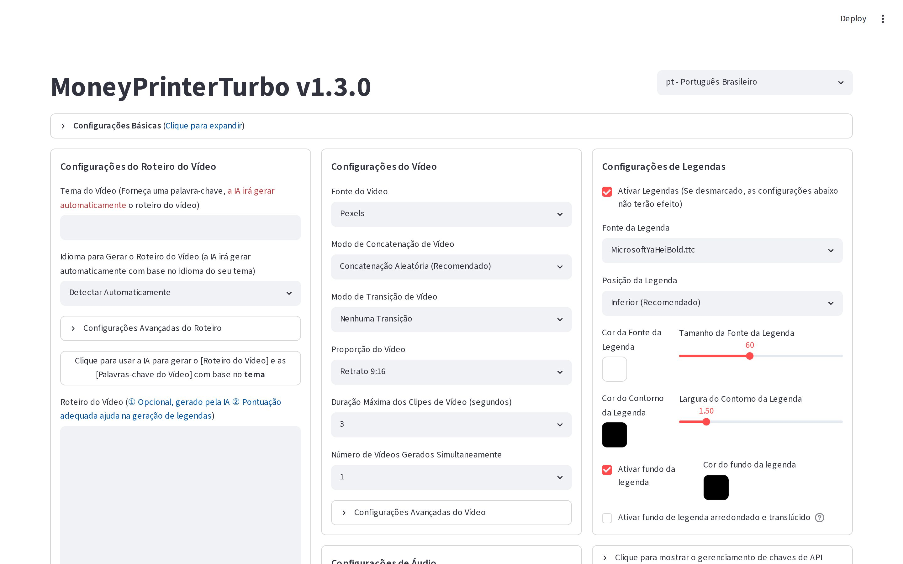

<h1 align="center">🎬 ModoTurbo BR 💸</h1>

<h3>A fábrica de vídeos com IA — em português, no seu computador</h3>

  
  
  

<h4><a href="README-pt-br.md">📖 Documentação</a> | <a href="README-en.md">English</a> | <a href="README-zh.md">简体中文</a> | <a href="README-ar.md">العربية</a></h4>

Digite um <b>assunto</b> — a IA escreve o roteiro, narra com voz brasileira, busca os vídeos de fundo,
sincroniza as legendas, coloca a música e entrega o <b>vídeo pronto para postar</b> em Reels, TikTok,
Shorts e YouTube. Tudo rodando no seu computador.

### A interface real, em português:

 

## ⚡ Experimente grátis agora

Um duplo clique instala tudo sozinho: Python, programa, dependências e o aplicativo com ícone na Área de Trabalho.

 

## 🆚 DEMO grátis × Ferramenta BR Completa

| Recurso | 🆓 DEMO | 💎 BR COMPLETA |
|---|:---:|:---:|
| Vídeos com narração e legendas em português | ✅ | ✅ |
| Instalação automática em 1 clique (Windows) | ✅ | ✅ |
| Aplicativo com ícone e bandeja do sistema | ✅ | ✅ |
| Roteiros por IA | Provedor gratuito | **Todos**: OpenAI, Gemini, DeepSeek, Claude via gateways e mais |
| Painel de configurações avançadas | 🔒 Bloqueado | ✅ Liberado |
| **Usar pelo iPhone/iPad em casa** (QR Code, vira app na tela de início) | ❌ | ✅ |
| **Usar pelo iPhone em qualquer lugar** (4G/5G, acesso remoto criptografado) | ❌ | ✅ |
| Instalação assistida e configuração das suas chaves | ❌ | ✅ |
| Suporte direto da THM TECNOLOGIA | ❌ | ✅ |

### 💎 Quer a Ferramenta BR Completa?

**Chame no Telegram:** 💬 <a href="https://t.me/rdllmsu">**t.me/rdllmsu**</a>

Resposta rápida • Instalação assistida • Suporte em português

 

## 🎯 O que a ferramenta faz

- 🤖 **Roteiro automático por IA** no idioma do assunto que você digitar — ou use o seu próprio texto
- 🗣️ **Narração com vozes brasileiras** naturais (Francisca, Antonio e outras), gratuitas
- 📝 **Legendas sincronizadas** com a fala, com fonte, cor, posição, contorno e fundo arredondado ajustáveis
- 🎞️ **Vídeos de fundo em HD e livres de direitos autorais** (Pexels/Pixabay) — ou seus próprios arquivos
- 🎵 **Música de fundo** com volume ajustável
- 📐 **Vertical 9:16** (Reels/TikTok/Shorts) e **horizontal 16:9** (YouTube), em alta definição
- 🔁 **Geração em lote**: várias versões de uma vez para você escolher a melhor
- 🔌 **API completa** para automação ([documentação interativa](docs/api-pt-br.jpg))

## 📚 Documentação técnica

- **[Documentação completa em português](README-pt-br.md)** — instalação manual, Docker, Colab, vozes, legendas e perguntas frequentes
- [Detalhes do instalador DEMO](instaladores/README.md) — o que ele faz, código-fonte auditável e como obter a versão completa

## ❓ Perguntas frequentes

<b>Como criar vídeos para TikTok, Reels e YouTube Shorts automaticamente com IA?</b>

Com o ModoTurbo você digita apenas o **assunto do vídeo** (por exemplo, "curiosidades sobre o espaço")
e a inteligência artificial faz o resto: escreve o roteiro, narra com voz brasileira, busca os vídeos
de fundo, sincroniza as legendas e entrega o arquivo final em alta definição, no formato vertical
9:16 pronto para postar.

<b>O ModoTurbo é um gerador de vídeos com IA grátis?</b>

A versão DEMO é gratuita e gera vídeos completos com narração e legendas em português usando um
provedor de IA gratuito. Os vídeos de fundo vêm do Pexels, que também oferece chave de API gratuita.
A Ferramenta BR Completa, com todos os provedores de IA e suporte, é uma oferta comercial da
THM TECNOLOGIA.

<b>A narração é em português do Brasil?</b>

Sim. O ModoTurbo usa vozes neurais brasileiras naturais e gratuitas (como Francisca e Antonio),
e as legendas são geradas em português, sincronizadas com a fala.

<b>Preciso saber editar vídeo?</b>

Não. Todo o processo — roteiro, narração, corte dos vídeos de fundo, legendas e música — é
automático. Você só escolhe o assunto e as preferências (voz, fonte da legenda, música) na
interface em português.

<b>Funciona no meu computador?</b>

Sim: Windows com instalador de 1 clique (a DEMO instala Python, dependências e cria o atalho
sozinha), e também macOS e Linux pela instalação manual ou Docker. Não precisa de placa de vídeo —
e quem tem GPU pode acelerar a renderização.

<b>Os vídeos têm direitos autorais?</b>

Os vídeos de fundo vêm de bancos gratuitos e livres de royalties (Pexels e Pixabay). O roteiro é
gerado por IA para o seu assunto, e a narração é sintetizada — você é responsável por revisar o
conteúdo antes de publicar.

## 📝 Licença e créditos

O software base ([MoneyPrinterTurbo](https://github.com/harry0703/MoneyPrinterTurbo), de
[harry0703](https://github.com/harry0703)) é
distribuído sob a licença [MIT](LICENSE). Os instaladores, a localização brasileira e o pacote de
distribuição BR são de autoria da **THM TECNOLOGIA** (MIT com manutenção obrigatória do aviso de
autoria). Os serviços de instalação assistida, acesso via iPhone e suporte são ofertas comerciais da
THM TECNOLOGIA.

© 2026 THM TECNOLOGIA — 💬 Telegram: <a href="https://t.me/rdllmsu">t.me/rdllmsu</a>

